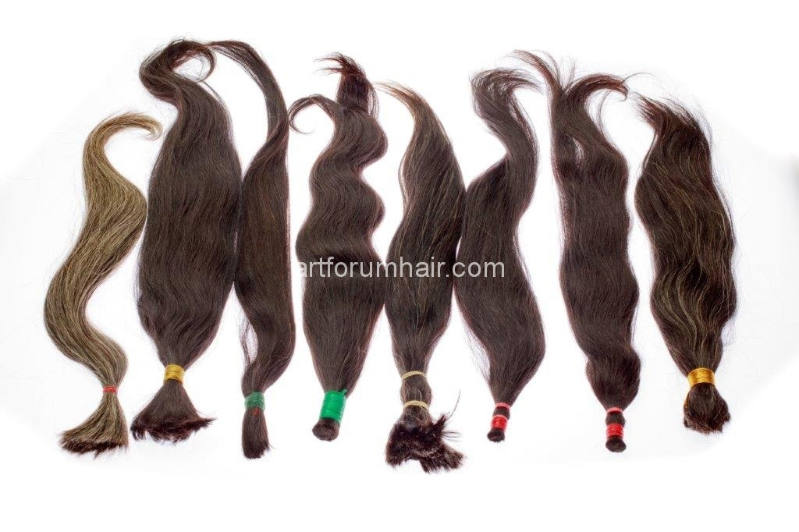

От какво се правят екстеншъните
04/16/2017  |  Няма коментари
През последните години пазарът на коса за удължаване нарастна неимоверно бързо. На него се предлага всичко – от евтини изкуствени екстеншъни от синтетични или животински влакна до най-висококачествени екстеншъни изработени от 100% човешка девствена коса. Според използваните материали екстеншъните могат да бъдат изработени от животински косми, синтетична и човешка коса.

Животински косми
Най-популярният тип животински косми, които се използват за изработка на екстеншъни са от як и конски косми. Тези косми са много по-дебели и твърди от човешката коса и ако екстеншъните са изработени изцяло от тях лесно се разпознават на външен вид и при допир. Ако има висок процент на добавена човешка коса е малко по-трудно. Характерно за космите от тези две животни е, че много добре задържат цвета след боядисване.

Изкуствена синтетична коса
Изкуствената синтетична коса се различава значително по външен вид и качество. За изработката й се използват основно синтетични полиестерни влакна. Напоследък някои китайски производители на изкуствена коса предлагат синтетични екстеншъни, които за кратко време издържат на по-ниските температури при изправяне и къдрене на косата. Разпознават се от човешката коса по това че човешката коса има естествен блясък, а синтетичните влакна имат много силен и неестествен блясък. При допир синтетичната коса трудно може да обърка с естествена. Като цяло за екстеншъните от синтетични влакна може да се каже, че в момента са най-достъпните, най-евтините и най-малко търсени на пазара по цял свят.

Човешка коса
Най-голямото предимство на екстеншъните от естествена човешка коса е, че изглеждат съвсем като вашата коса и при правилни грижи имат много дълъг живот. Цената им е по-висока в сравнение със синтетичната. Най-често естествената човешка коса е с произход Азия (Индия, Китай) и Европа.
Надяваме се че ви бяхме полезни и ще можете да разпознаете екстеншъни от естествена и синтетична коса. Нашият съвет е да си купувате екстеншъни от фризьорски салон с добра репутация, които предлагат само естествена висококачествена човешка коса.

