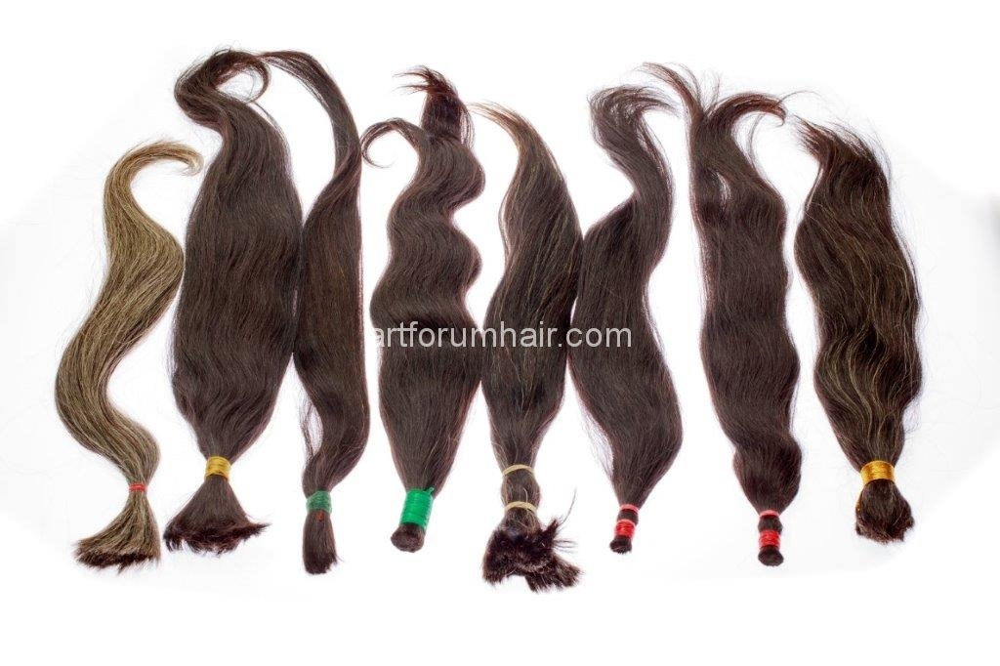

Всяка булка иска да изглежда красива и неотразима на сватбения си ден. Косата е един от детайлите, по които ясно се откроява симпатичната булка от невероятно красивата булка. Така, че внимателно избере прическата за най-големия ден в живота Ви. Същевременно не винаги нашата естествена коса има подходящата дължина, цвят и плътност за мечтаната сватбена прическа. Затова на помощ идват екстеншъните за да бъде косата ви по-дълга, плътна и разбира се да изглеждате напълно естествени.

Възползвайте се от нашите съвети и бъдете зашеметяващо красиви на сватбения си ден!

Изберете най-доброто качество коса
На първо място се уверете, че сте избрали най-доброто качество естествена човешка коса от която са изработени екстеншъните и отидете при фризьор, които има значителен опит в тази сфера. Заедно с него изберете най-подходящите за вас екстеншъни – по отношение на дължина, цвят и количество коса. Добре би било фризьорският салон да предлага собствен асортимент удължения за коса и закупуването и поставянето им да става на едно и също място.

Кой метод за удължаване на коса е най-подходящ за вас
Вече писахме за основните методи за удължаване на коса. Ние от Art Forum Hair винаги подхождаме персонално към всеки наш клиент и не бихме могли да кажем кой метод е най-добър за сватбена прическа. Опитът обаче показва,  че при сватбените прически основно се използва методът на удължаване със стикери (ленти). Те са изключително дискретни в сравнение с останалите методи и могат да се носят в продължение на 2-3 месеца. Лепенките са водоусточиви и спокойно можете да плувате и ходите на плаж по време на медения си месец.

Кога е най-добре да сложим удълженията за коса
Ако сте решили да използвате екстеншъни, специалистите препоръчват да го направите най-малко 2 седмици преди сватбения ден. Това време е напълно достатъчно да свикнете с новата си визия, да направите пробна прическа и да смените цвета на косата си ако желаете.

С помощта на екстеншъните можете да имате перфектната прическа на Вашия най-специален ден!

